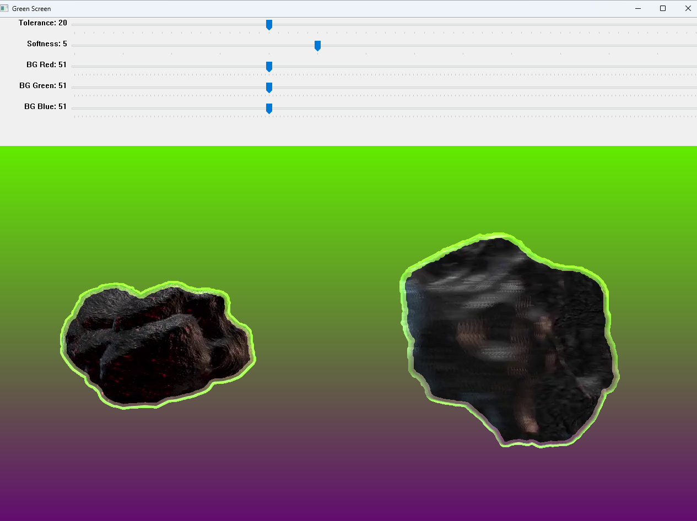

# Green Screen Video Processing with Dynamic Backgrounds

This Python project utilizes OpenCV to apply **green screen effects** to video files. The program allows dynamic control over the green screen's tolerance, softness, and background color through interactive sliders. It uses a mouse-click to select a reference patch for background removal and applies a gradient-based background that changes over time.

---

## Features

- **Interactive Control**: Adjust tolerance, softness, and background color dynamically with trackbars.
- **Green Screen Effect**: Removes the green screen background from the video and replaces it with a gradient-based background.
- **Background Color Animation**: The background color dynamically changes over time based on frame numbers.
- **Custom Patch Selection**: Select a patch in the video to define the green color to be replaced.
- **Video Output**: The processed video is saved as `output_video.mp4`.

---

**Usage**
1.**Run the script:**
`python green_screen_video_processing.py`

2. **Adjust Sliders:** Use the sliders to control:
-   Tolerance: Adjusts how much green is detected (0-100).
-   Softness: Controls the smoothness of the mask (1-20).
-   Background Color: Set the RGB values of the dynamic background.

3.**Select a Patch:** Click on the video window to select a patch of the background to determine the green color to be replaced.

4. **Output:** The processed video is saved as **output_video.mp4** and will display in a separate window. Press **ESC** to stop the video and exit the program.

---

